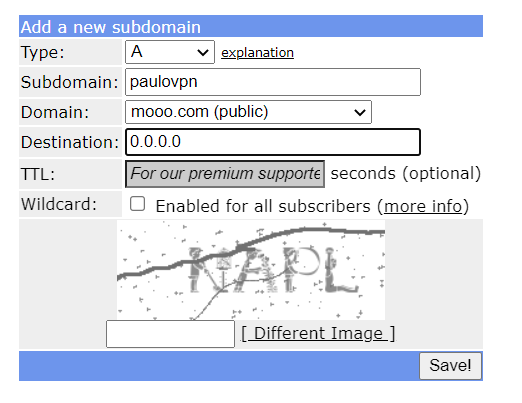

# Summary
Instructions on how to set a home VPN using Raspberry Pi Zero w.

## 1.Prepare Raspberry OS SD card
- Download the [Raspberry Pi Imager](https://www.raspberrypi.com/software/).
- Pick Raspberry OS Lite. Don't forget to set the SSH password in the Raspberry Imager before burning the SD Card. Now just creating an emapty "ssh" file won't work. Also set the connection wi-fi details.  

## 2. Update the Raspberry OS
- Access the RPi by ssh, using linux terminal or windows powesheel, by typing `ssh pi@raspberrypi.local` (assuming you're using "pi" as username) and then input the password you've entered before in the Raspberry OS Imager settings.
- Update the Raspberry OS `sudo apt update && sudo apt upgrade`
- Finally `sudo reboot`

## 3. Set dynamic DNS
- For this tutorial I'll use freeDNS. Go to [FreeDNS](https://freedns.afraid.org/) and signup. After registration and checking your email address, got to "Add subdomain".
- Chose any subdomain name you like, pick a domain and change destination (which should have your current IP) to **0.0.0.0**. The reason to pick this IP is to see it change afterwards, if all goes well.

