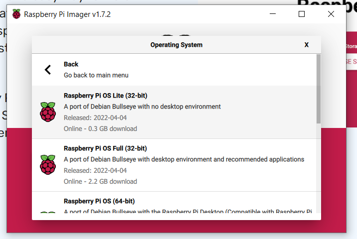
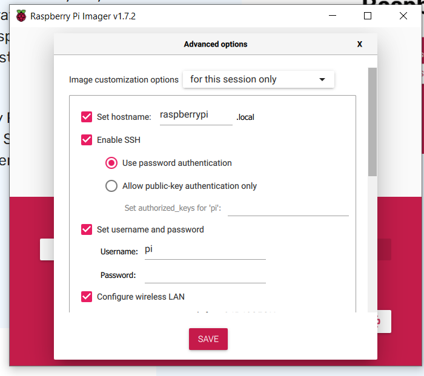

# Summary
Instructions on how to set a home VPN using Raspberry Pi Zero w.

## 1.Prepare Raspberry OS SD card
- Download the [Raspeberry Imager](https://www.raspberrypi.com/software/).
- Pick Raspberry OS Lite. Don't forget to set the SSH password in the Raspberry Imager before burning the SD Card. Now just creating an emapty "ssh" file won't work. Also set the connection wi-fi details.  

